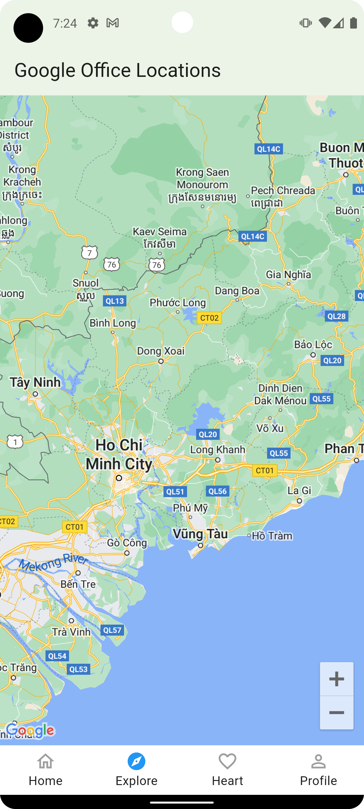
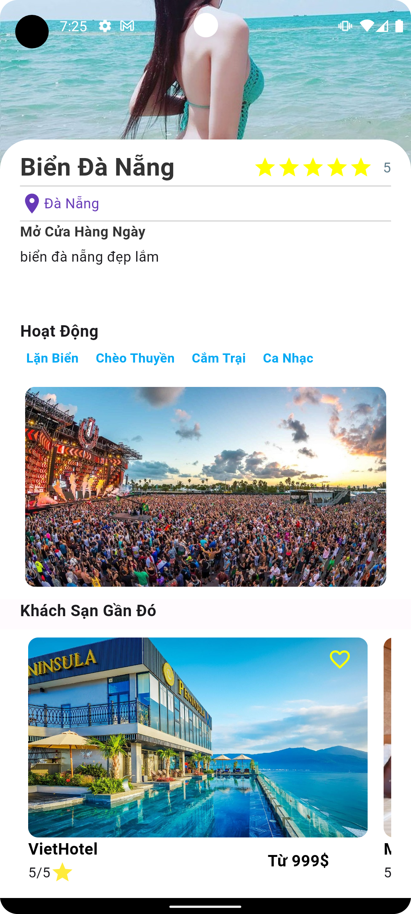
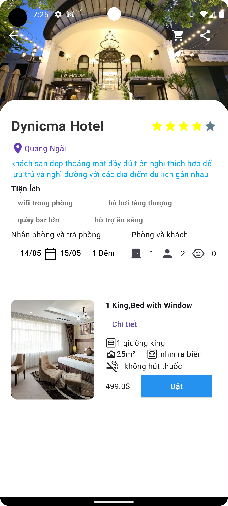
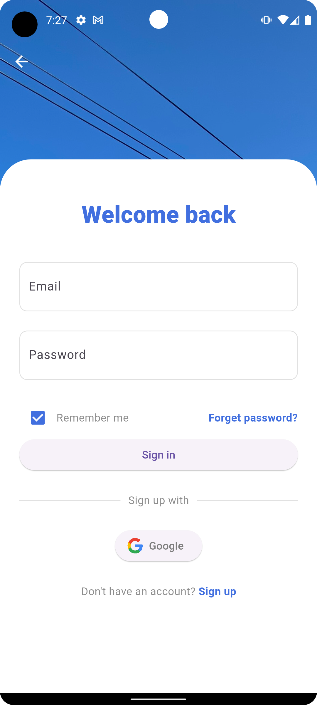
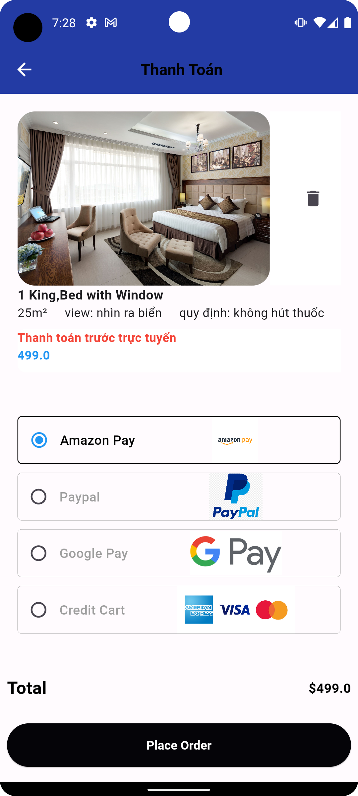
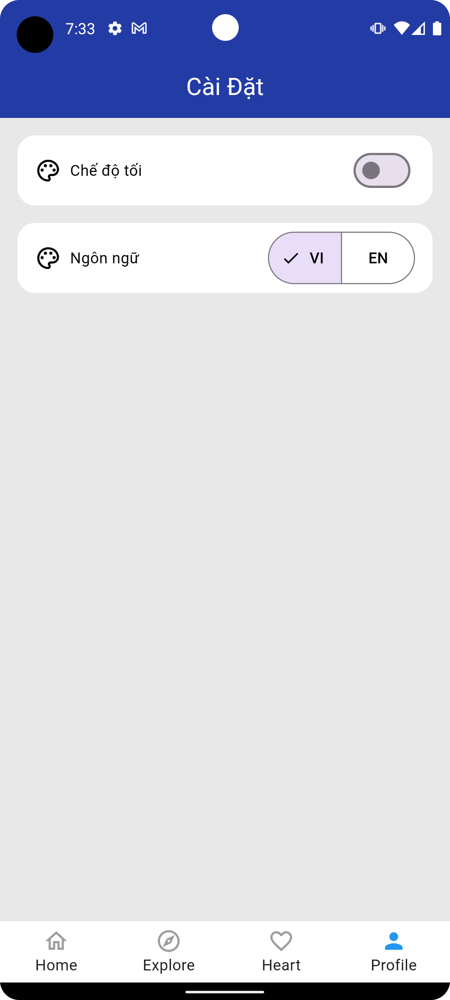

# Vietnam travel application using flutter & firebase 
## Đồ Án Cơ Sở Trường Đại Học Công Nghệ TP.HCM (Hutech)  
## Author : <a href="https://www.facebook.com/huynh.viet.7771">Huỳnh Đắc Việt</a>   

## Getting Started
step 1:git clone https://github.com/HDV2k3/travel_vietnam  
step 2:flutter pub get   
## Result

  

    
    
     
    
     
  

  

    
    
    
    
  

